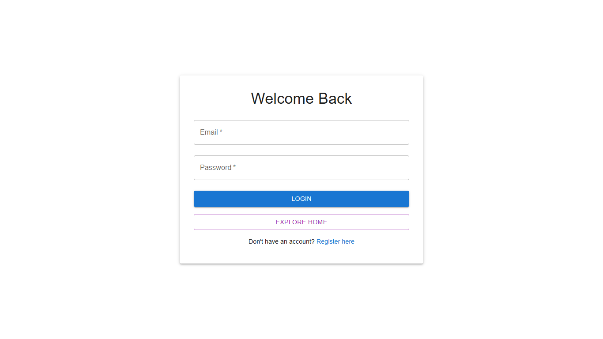
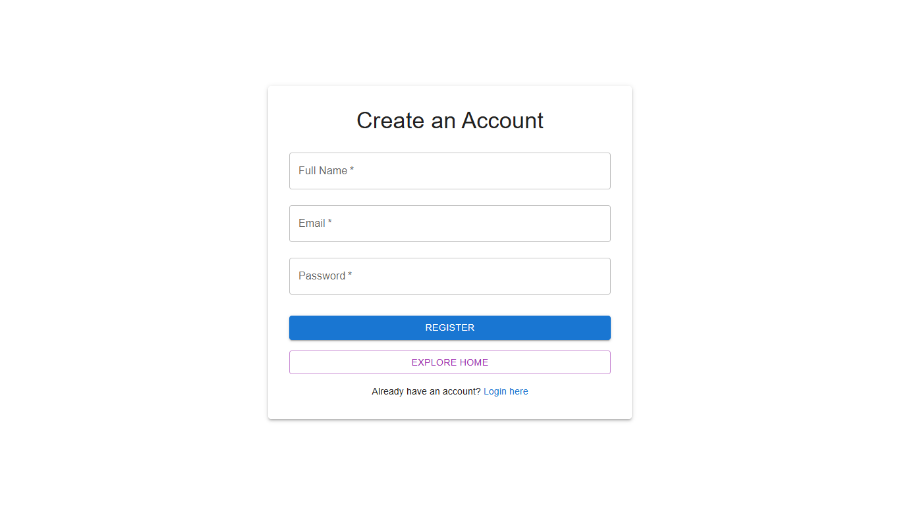
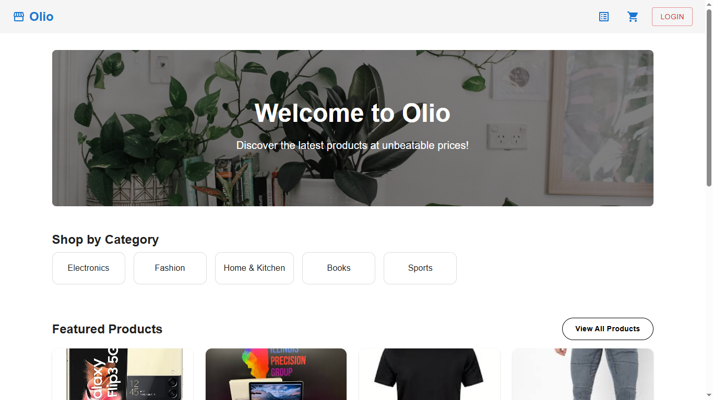
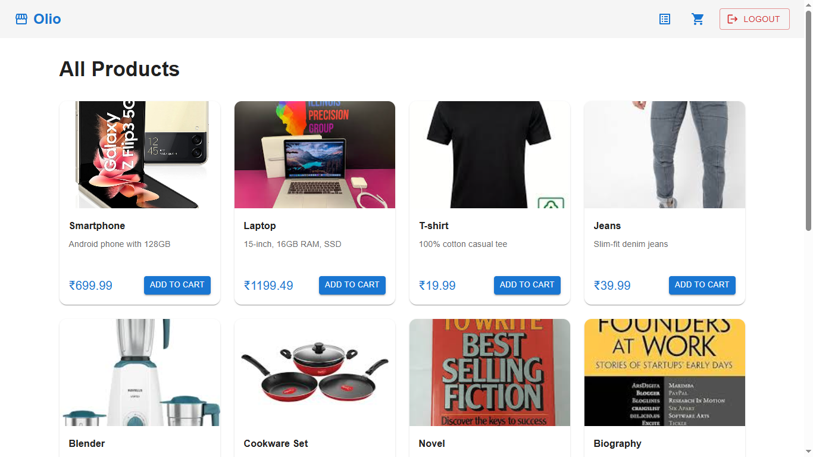
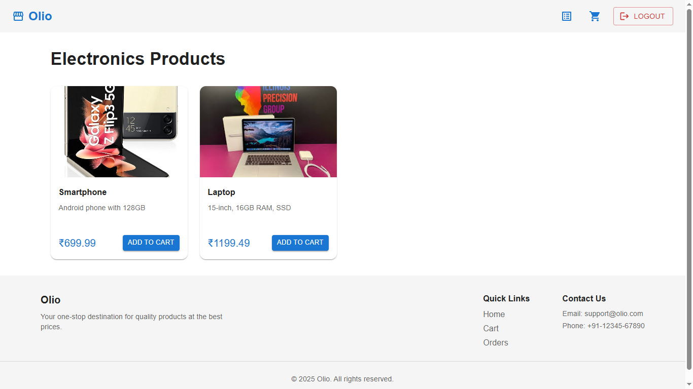
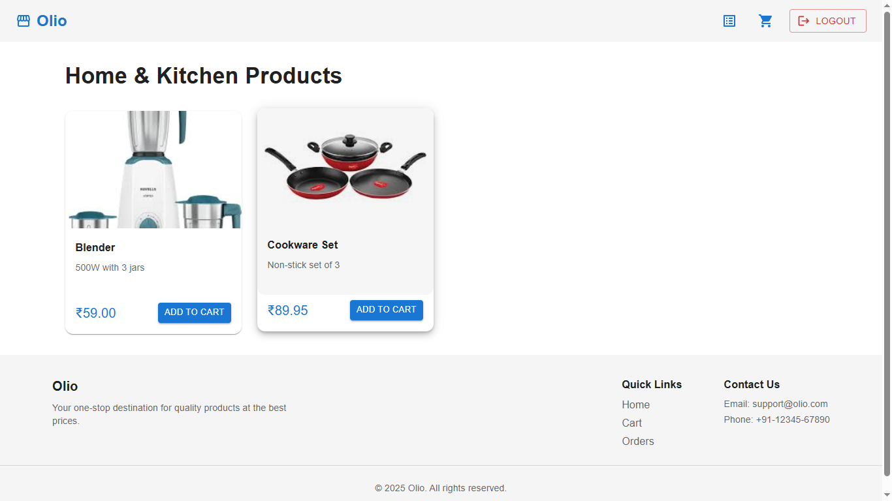
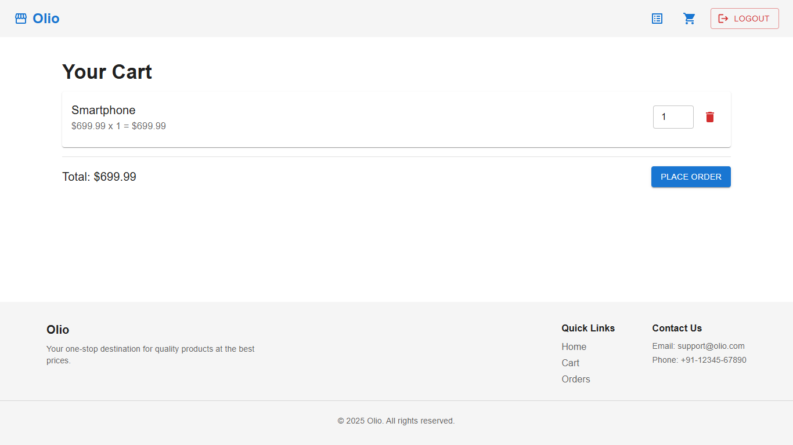
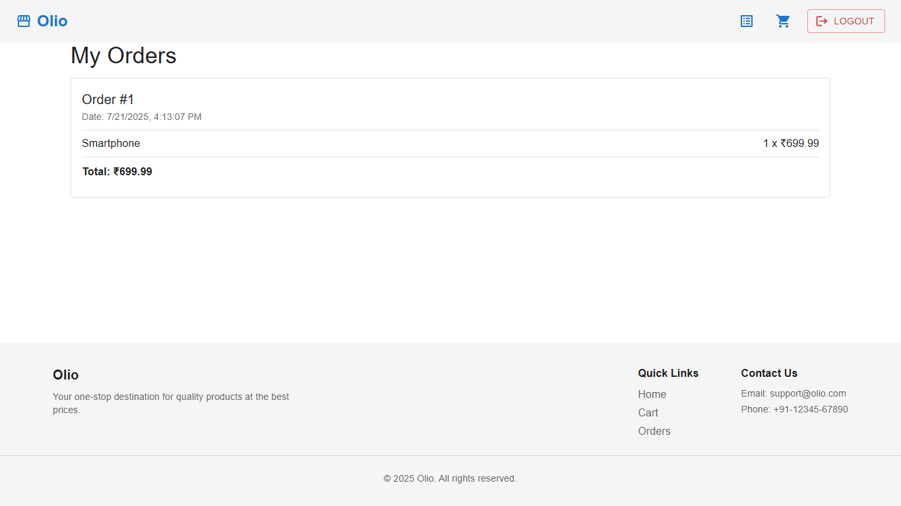

# 🛍️ Olio - eCommerce Frontend

**Olio** is a modern and responsive frontend for a full-stack eCommerce platform. Built using **React + Vite** and **Material UI**, it offers smooth navigation, JWT-based authentication, protected routes, and seamless integration with a Spring Boot backend.

---

### 🚀 Live Demo

👉 [View Live](https://olio-frontend-nlhh.vercel.app/)  
<!-- 🔐 Admin login enabled (read-only view for public users) -->

---

### 🖼️ Screenshots

#### Login Page

#### Home View

#### All Product View

#### Product Category View

#### Cart View

#### Orders View

---

## ⚙️ Tech Stack

- **React** with **Vite**
- **TypeScript**
- **React Router DOM** – routing and navigation
- **Material UI (MUI)** – clean, responsive design
- **Axios** – for API requests
- **JWT Authentication**

---

## ✨ Features

- 🔐 **User Authentication** (Login/Register) using JWT
- 🏠 **Public Pages**: Home, Products, Product Details
- 🔒 **Protected Pages**: Cart, Orders
- 📦 **Category-based product filtering**
- 🛒 **Cart Management**
- 📜 **Order History**
- 💻 **Responsive Layout** for all screen sizes
- 🔁 **Persistent Login** with token storage

---

## 📁 Project Structure

src/  
├── components/  
├── pages/  
├── services/  
├── types/  
├── utils/  
├── App.tsx  
└── main.tsx

---

### 🌍 Deployment

Frontend: https://olio-frontend-nlhh.vercel.app

Backend: https://olio-backend-x2hq.onrender.com

### 📦 Backend Repository

👉 [Olio Backend](https://github.com/evoAB/olio-backend)